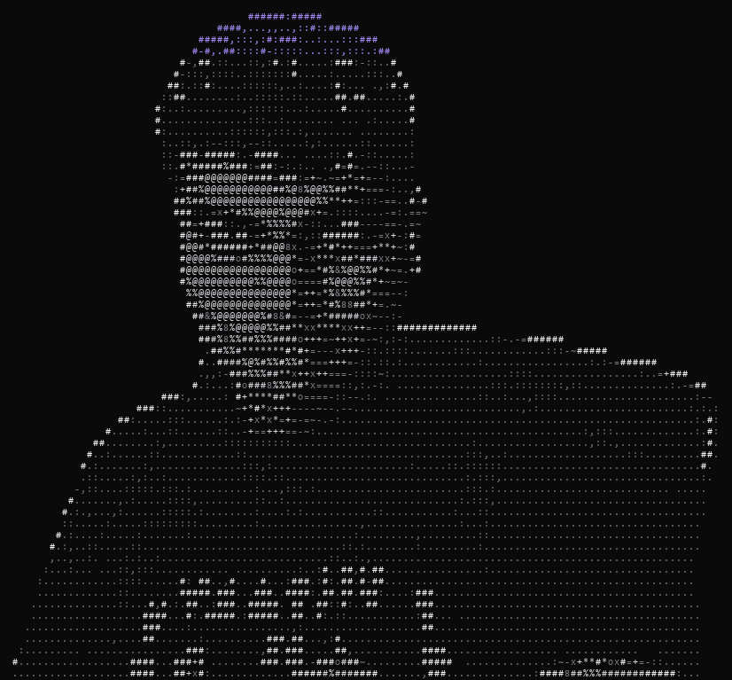

  

 

  

## &nbsp; `01` About

<table width="100%">
<tr>
<td width="60%" valign="top">

**AI/ML &amp; Full-Stack Software Engineer** architecting production web platforms, applied machine learning pipelines, and edge IoT devices. Started with Kali Linux exploits in 2021; now shipping payment-integrated SaaS at **Kaizen Training Solutions** and researching EEG neural recognition at **Krea University**.

> <i>Comfortable moving between a FastAPI training pipeline, a Next.js checkout flow, and a merged PR into an OWASP Foundation repo — in the same week.</i>

- 🛡️ **Open Source Security** — Merged production security PR into **[OWASP/Nest](https://github.com/OWASP/Nest)** (`#3799`) · Next.js 16 edge middleware proposed to **[opennextjs-cloudflare](https://github.com/opennextjs/opennextjs-cloudflare)** (`#1280`, `1.8k★`)
- 🧠 **Neural Computing &amp; BCI** — EEG emotion classification (**[eeg-seed-IV](https://github.com/ScienHAC/eeg-seed-IV)** — 87% accuracy on 15k+ trials) + embedded robotics (**[object-sorting-Rarm](https://github.com/ScienHAC/object-sorting-Rarm)**)
- 💳 **Fintech SaaS Architecture** — Razorpay-integrated checkout and billing infrastructure serving 200+ concurrent users with zero downtime

</td>
<td width="40%" valign="top" align="center">

<table width="100%">
<tr><td align="left">🔴&nbsp;🟡&nbsp;🟢&nbsp;&nbsp;<code>whoami --render-ascii</code></td></tr>
<tr><td align="center"></td></tr>
</table>

</td>
</tr>
</table>

## &nbsp; `02` Now

| Timeline | Role & Organization | Core Focus & Impact | Status |
|---|---|---|:---:|
| **Oct 2025 → Present** | **Software Developer** · Kaizen Training Solutions | Next.js/FastAPI production features, Razorpay payments, 200+ concurrent users |  |
| **Jul – Aug 2025** | **Backend Engineer** · NeedCFO | Fintech platform architecture, ML support chatbot (85% resolution rate) |  |
| **Jun – Aug 2025** | **Research Intern** · Krea University | EEG emotion recognition deep learning — 87% accuracy on 15k+ EEG samples |  |

## &nbsp; `03` Open Source

Real merged pull requests and contributions into high-impact open-source foundations.

| Repository | PR & Contribution Description | Impact / Status |
|---|---|:---:|
| **[OWASP/Nest](https://github.com/OWASP/Nest)** Nonprofit Cybersecurity Foundation | [`#3799`](https://github.com/OWASP/Nest/pull/3799) — Hardened production settings: GraphQL introspection lockdown, HSTS, and strict security headers |  |
| **[opennextjs/opennextjs-cloudflare](https://github.com/opennextjs/opennextjs-cloudflare)** ★ 1.8k+ Cloudflare Next.js adapter | [`#1280`](https://github.com/opennextjs/opennextjs-cloudflare/pull/1280) / [`#1309`](https://github.com/opennextjs/opennextjs-cloudflare/pull/1309) — Next.js 16 Node.js middleware (`proxy.ts`) support |  |

## &nbsp; `04` Featured Work

<table width="100%">
<tr>
<td width="50%" valign="top">
<h4>⚡ <a href="https://github.com/ScienHAC/arista">arista</a> · <a href="https://arista-bits.vercel.app/">live ↗</a></h4>

Trading &amp; portfolio intelligence analytics platform.

 
</td>
<td width="50%" valign="top">
<h4>🌱 <a href="https://github.com/ScienHAC/ventspace">VentSpace</a> · <a href="https://ventspace-ai.vercel.app">live ↗</a></h4>

Hack4Humanity 2025 — AI-supported emotional venting paired with real-world tree planting.

 
</td>
</tr>
<tr>
<td width="50%" valign="top">
<h4>🧠 <a href="https://github.com/ScienHAC/mentorAI">logikXmind</a> · <a href="https://logikxmind.com">live ↗</a></h4>

AI mentorship platform with personalized learning paths and automated skill tracking.

 
</td>
<td width="50%" valign="top">
<h4>🔬 <a href="https://github.com/ScienHAC/eeg-seed-IV">eeg-seed-IV</a></h4>

Deep learning EEG emotion recognition research — 87% accuracy across 15k+ time-series trials.

 
</td>
</tr>
<tr>
<td width="50%" valign="top">
<h4>📊 <a href="https://github.com/ScienHAC/ai-financial-advisor">ai-financial-advisor</a> · <a href="https://ai-financial-advisor-red.vercel.app">live ↗</a></h4>

LLM-driven portfolio evaluation engine and automated risk analysis.

 
</td>
<td width="50%" valign="top">
<h4>📡 <a href="https://github.com/ScienHAC/dbiot">dbiot</a></h4>

Flutter + embedded hardware telemetry and IoT device control hub.

 
</td>
</tr>
<tr>
<td width="50%" valign="top">
<h4>🦾 <a href="https://github.com/ScienHAC/object-sorting-Rarm">object-sorting-Rarm</a></h4>

Embedded robotic arm control for automated object classification &amp; sorting (PlatformIO/C++).

 
</td>
<td width="50%" valign="top">
<h4>🚀 <a href="https://github.com/ScienHAC?tab=repositories">32 Public Repositories ↗</a></h4>

Explore all open-source projects, neural models, IoT firmware, and developer utilities.

</td>
</tr>
</table>

## &nbsp; `05` Stack

<table width="100%">
<tr>
<td width="50%" valign="top">
<h4>💻 Core Languages &amp; Systems</h4>

  
<code>Python</code> · <code>C++20</code> · <code>C</code> · <code>Java</code> · <code>TypeScript</code> · <code>JavaScript</code>
</td>
<td width="50%" valign="top">
<h4>🧠 AI / ML &amp; Neural Computing</h4>

  
<code>TensorFlow</code> · <code>PyTorch</code> · <code>Scikit-Learn</code> · <code>OpenCV</code> · <code>NumPy</code>
</td>
</tr>
<tr>
<td width="50%" valign="top">
<h4>🌐 Web &amp; API Architecture</h4>

  
<code>Next.js 16</code> · <code>FastAPI</code> · <code>React</code> · <code>Node.js</code> · <code>GraphQL</code> · <code>REST</code>
</td>
<td width="50%" valign="top">
<h4>☁️ Cloud, Databases &amp; DevOps</h4>

  
<code>PostgreSQL</code> · <code>Supabase</code> · <code>MongoDB</code> · <code>Docker</code> · <code>AWS</code> · <code>CI/CD</code>
</td>
</tr>
<tr>
<td colspan="2" width="100%" valign="top">
<h4>🛡️ Hardware, Embedded &amp; Security</h4>

  
<code>Arduino</code> · <code>Raspberry Pi</code> · <code>PlatformIO</code> · <code>Kali Linux</code> · <code>OWASP Hardening</code> · <code>Embedded C++</code>
</td>
</tr>
</table>

## &nbsp; `06` Stats

 

  

 

  

 

372 LeetCode problems solved (115 Easy · 198 Medium · 59 Hard) · 1 merged PR into an OWASP Foundation repo · building in public from Gurugram, India

 

